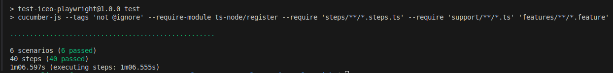

# Playwright Automation Testing - ICEO

This repository contains automated tests developed for the **ICEO** project using **TypeScript**, **Playwright**, and **Cucumber**.

## Overview

The automation suite is designed to validate the contact form on the ICEO website, ensuring proper behavior for both valid and invalid inputs. It also includes a scenario to verify the response from the env.json endpoint. The suite currently covers 6 test cases.

## Requirements

You must have Node.js installed on your machine. You can download it here: [https://nodejs.org](https://nodejs.org)

#### Dependencies

The project in TypeScript uses some NPM dependencies already configured (you only need to do run the npm install command), as follows:

- [playwright](https://www.npmjs.com/package/playwright)
- [@playwright/test](https://www.npmjs.com/package/@playwright/test)
- [@cucumber/cucumber](https://www.npmjs.com/package/@cucumber/cucumber)
- [@types/node](https://www.npmjs.com/package/@types/node)
- [typescript](https://www.npmjs.com/package/typescript)
- [ts-node](https://www.npmjs.com/package/ts-node)

After cloning the repository, install the required dependencies by running:

```bash
npm install
```

## Running the Tests

To start the test runner in headless execution:

```bash
npm test
```

Alternatively, for in interactive mode:

```bash
npm run test:headless
```

## Test Coverage

The following test scenarios are included:

- Submit contact form with valid data;
- Submit contact form with blank fields;
- Submit contact form with multiple invalid email formats;
- Validate GET request to the `env.json` endpoint.

You can find all test cases in:

```
features/
```

## Example - Automation in Action


